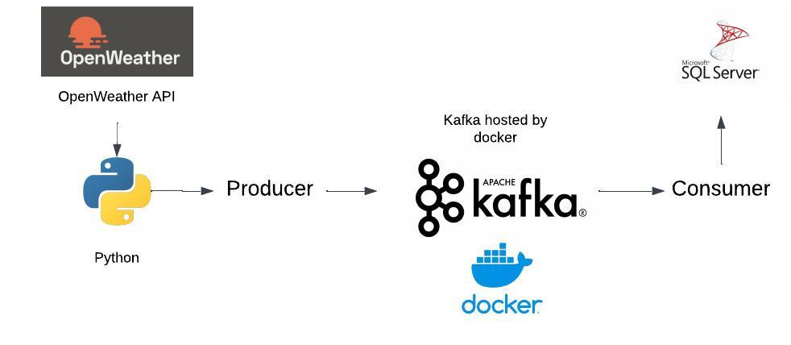

# Real-Time Weather Data Pipeline

## Introduction
This project implements a real-time data pipeline to collect, process, and analyze weather data using a combination of Python, Apache Kafka, Docker and SQL Server. The goal of this pipeline is to ingest live weather data, perform transformations, and load it into a database for data analyst or scientist to predict weather.

## Key Objectives:
**Data Ingestion**: Capture live weather data streams using Kafka and OpenWeather API.
**Data Storage**: Store the incoming data in SQL Server.
**Data Transformation**: Use python to aggregate required data.
**Data Analysis**: Query and analyze the transformed data using SQL Server.
This project demonstrates the integration of various modern technologies to build an end-to-end, scalable, and efficient real-time data solution.

## Architecture Diagram

## Technology Used
1. **Python**: Core programming language for data processing.
2. **Apache Kafka**: Real-time streaming and messaging platform.
3. **Microsoft SQL Server**: storage for storing processed data.
4. **Docker**: Container service to host programs.

## Workflow Summary
Refer to the initial_setup.txt file for setup instructions.

## Dataset Used
Using real time data that is generated from Open Weather API. 

### Refer stepbystepguide.txt file for guidance and results file for proof of results
